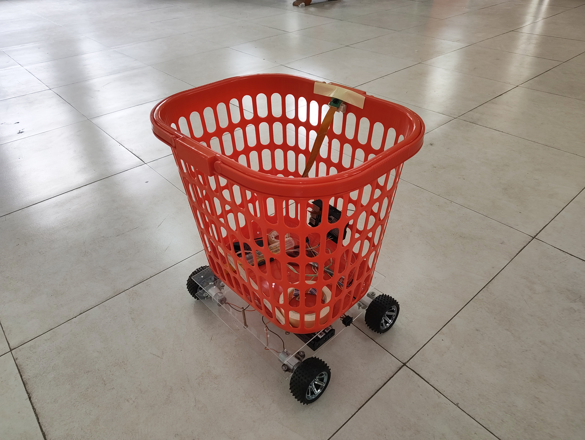

# Human Following Shopping Cart

A Control System Laboratory project implementing an autonomous shopping cart that follows a human target using monocular vision, real-time tracking, and differential drive control.

## Features

* Human detection using YOLOv8
* Multi-object tracking with BoT-SORT
* PID-based steering and throttle control
* Differential drive motor control
* Real-time visual monitoring interface

## Hardware Used

* Raspberry Pi 5
* Pi Camera Rev 1.3
* L298N Motor Driver
* 25GA DC Gear Motors
* 18650 Li-ion Battery Pack

## Software Modules

* `app.py` → Main control loop
* `camera.py` → Camera handling
* `hud.py` → Visual overlay display
* `motor_driver.py` → Motor actuation
* `pid_controller.py` → Control logic
* `config.py` → Parameter settings

## Running the Project

```bash
python app.py
```

## Authors

Md. Mozammel Hossain Fazle Rabbi,
Taimir Tanha Bin Harun,
Ashraf Al-Amin,
Farhana Mehnaz Maisha,
Sabab Muhammad,
Mustakim Billah Nafee
